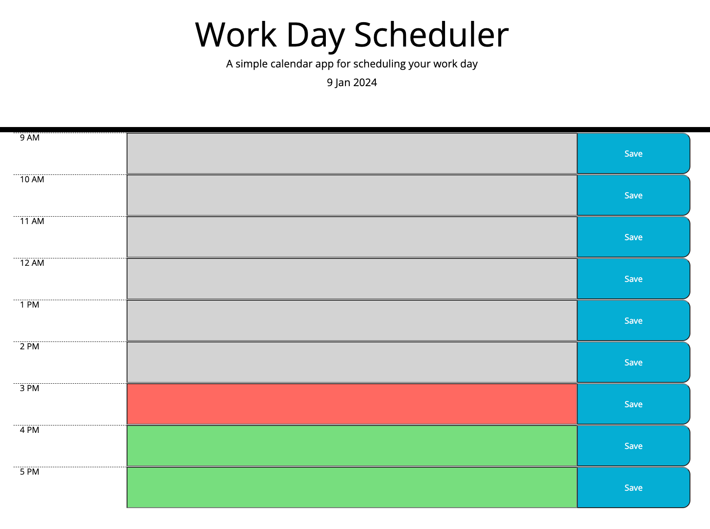

# Work-Day-Scheduler

A simple calendar application that allows a user to save events for each hour of the day. This app runs in the browser and features dynamically updated HTML and CSS powered by jQuery.

## Description

This app offers the following features:

- Displays the current day prominently at the top of the calendar upon opening the planner.

- Presents time blocks for standard business hours as the user scrolls down.

- Each time block is color-coded to indicate whether it is in the past, present, or future.

- Users can enter tasks by clicking on a time block.

- Users can save tasks in local storage by clicking the save button within a time block.

- Events persist even when the page is refreshed.

## Project status

Deployed: https://anna702.github.io/Work-Day-Scheduler/

## Project Screenshot

## Project GIF

## License

MIT License

## Q&A

In case you have any questions, feel free to contact me at <a href="mailto:annanvks@gmail.com?">annanvks@gmail.com</a>.
